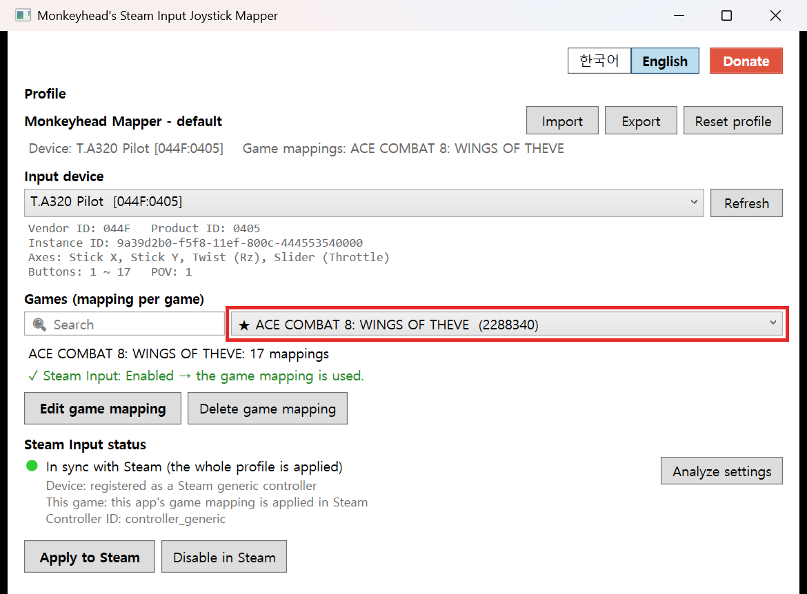
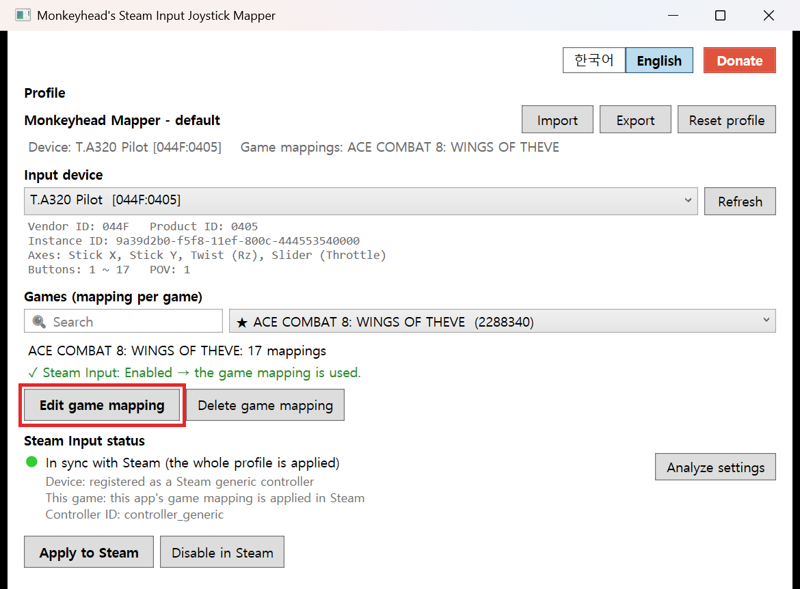
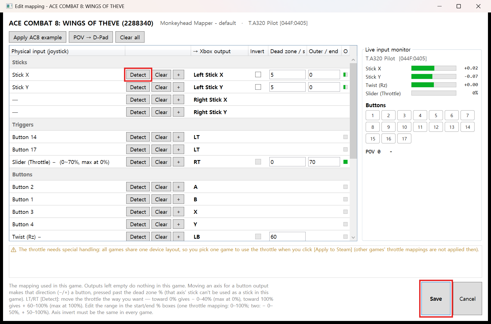
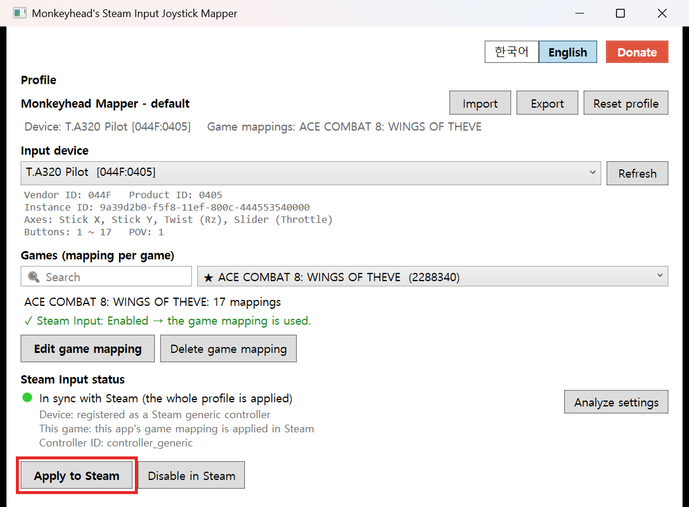

🌏[한국어](README.kr.md) | [English](README.en.md)

# Monkeyhead's Steam Input Joystick Mapper

An app that uses Steam Input's controller support to **turn a flight joystick (flight stick) into an Xbox gamepad**.
Fly with your flight stick even in games that don't support flight sticks.

## How to use

### 1. Select a game

Choose the game to map. Installed Steam games are listed, and you can search by typing a name in the box on the left.

### 2. Click [Edit game mapping]

### 3. Assign buttons with [Detect]

In the mapping editor, click **[Detect]** next to the Xbox output you want, then press the button or move the axis on your joystick — it is assigned right away. When you're done, click **[Save]**.

> With ACE COMBAT 8 and a T.A320 Pilot, **[Apply AC8 example]** fills in a ready-to-use mapping in one click.

### 4. Click [Apply to Steam] in the main window

If Steam is running, it is closed before applying. When it's done, start Steam and launch your game.

To undo, click **[Disable in Steam]**. Steam sees the device as a plain joystick again, and your game mappings are kept.
