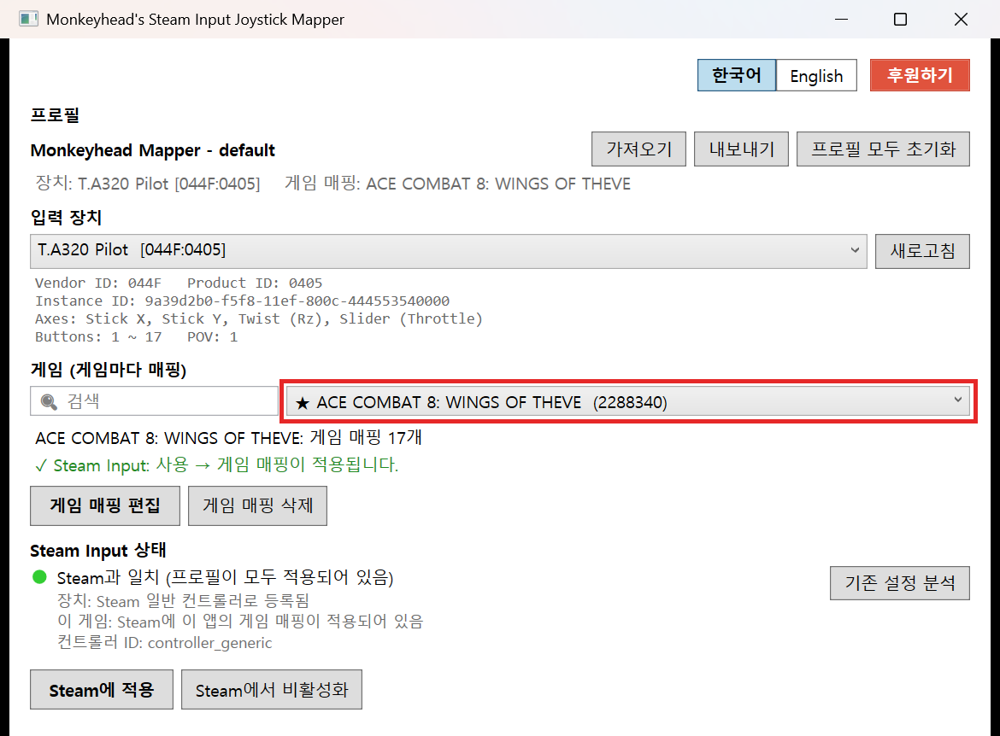
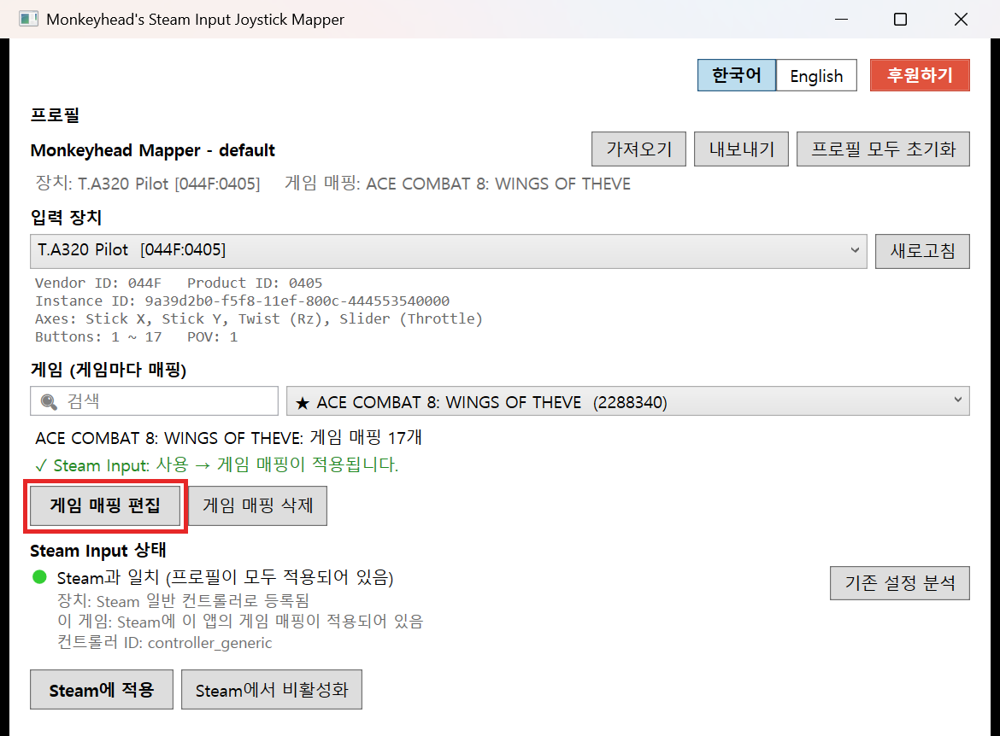
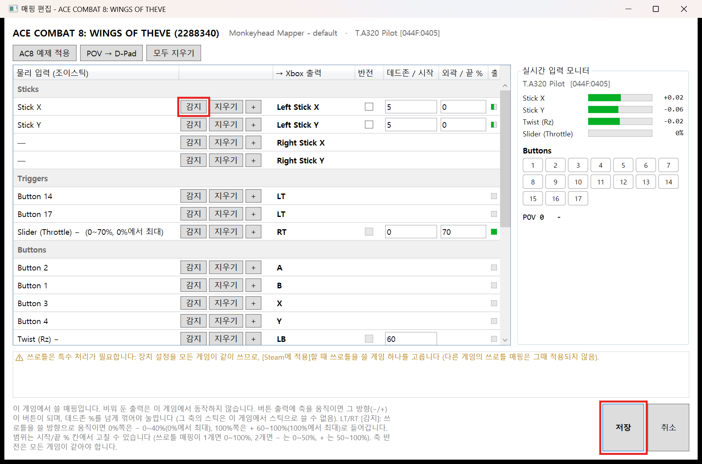
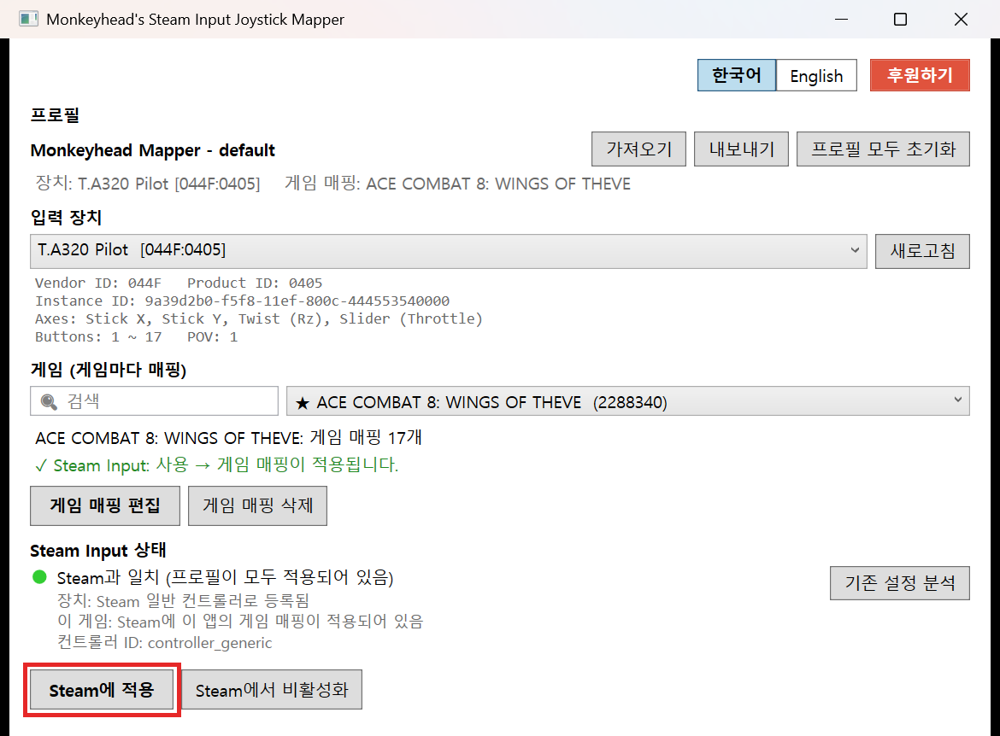

🌏[한국어](README.kr.md) | [English](README.en.md)

# Monkeyhead's Steam Input Joystick Mapper

Steam Input의 컨트롤러 기능으로 **비행 조이스틱(플라잉 스틱)을 Xbox 게임패드처럼 쓸 수 있게** 해 주는 앱입니다.
플라잉 스틱을 지원하지 않는 게임에서도 플라잉 스틱으로 비행을 즐길 수 있습니다.

## 사용법

### 1. 게임 선택

매핑할 게임을 고릅니다. 설치된 Steam 게임이 목록에 나오며, 왼쪽 칸에 이름을 입력해 검색할 수 있습니다.

### 2. [게임 매핑 편집] 클릭

### 3. [감지]로 버튼 할당

매핑 편집 창에서 원하는 Xbox 출력의 **[감지]** 를 누른 뒤, 조이스틱에서 쓸 버튼을 누르거나 축을 움직이면 바로 할당됩니다. 다 끝나면 **[저장]** 을 누릅니다.

> 에이스 컴뱃 8 + T.A320 Pilot이라면 **[AC8 예제 적용]** 한 번으로 바로 쓸 수 있는 매핑이 채워집니다.

### 4. 메인 창에서 [Steam에 적용]

Steam이 실행 중이면 종료한 뒤 적용합니다. 적용이 끝나면 Steam을 실행하고 게임을 시작하세요.

되돌리려면 **[Steam에서 비활성화]** 를 누르세요. Steam에서 다시 일반 조이스틱으로 보이며, 만들어 둔 게임 매핑은 그대로 남습니다.
